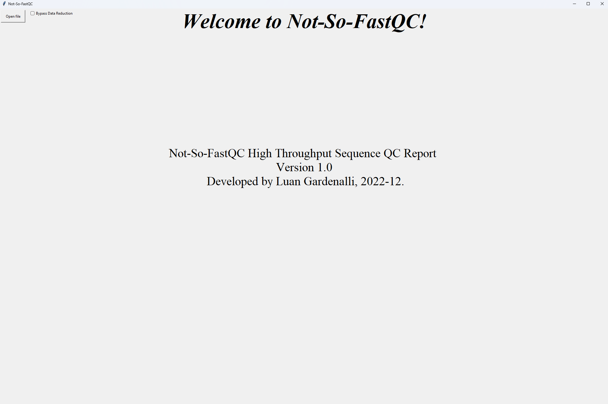
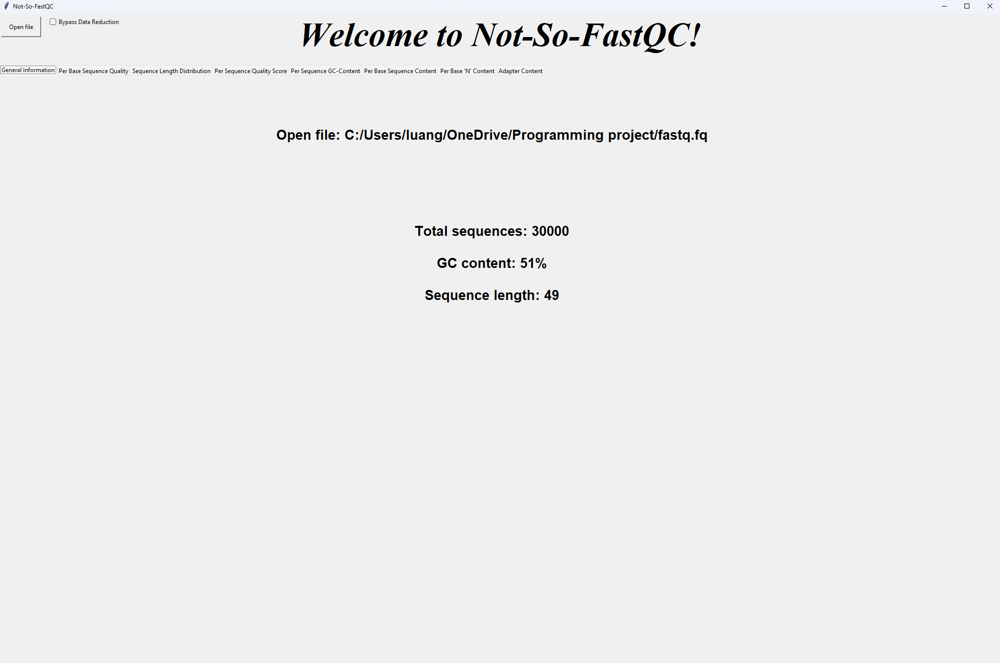
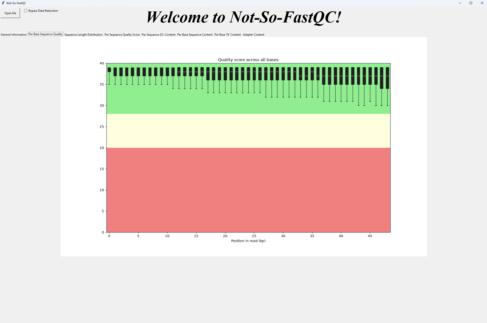
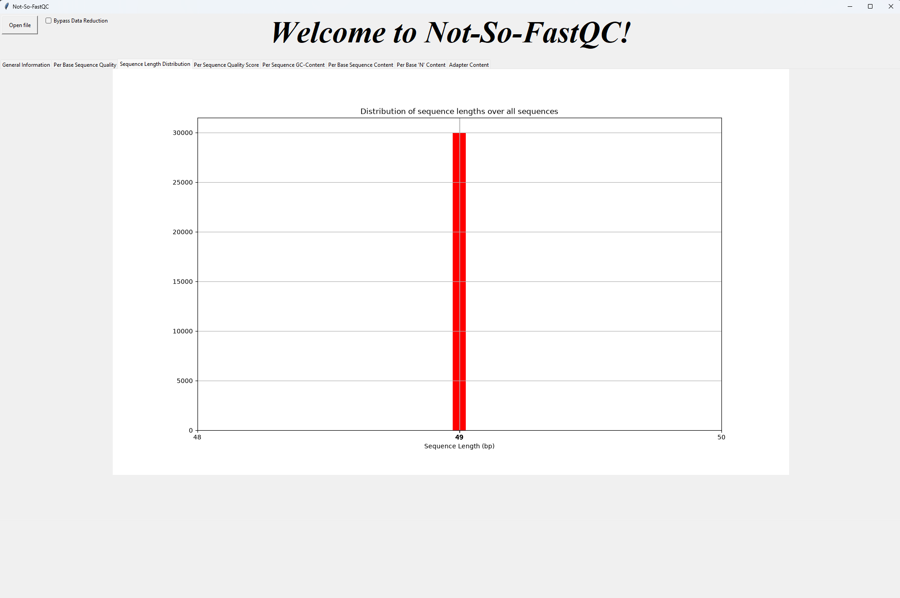
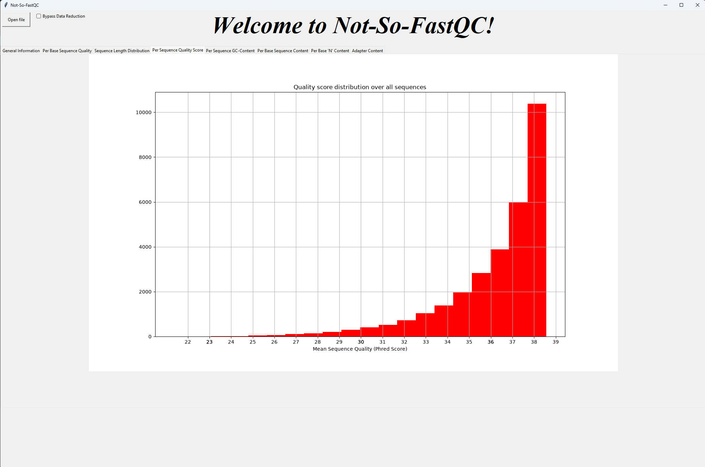
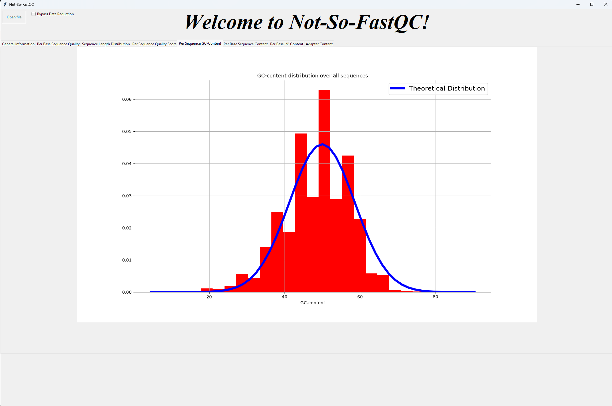
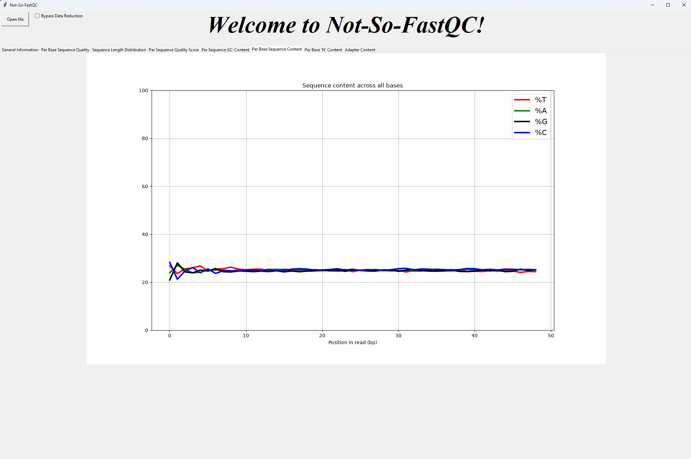
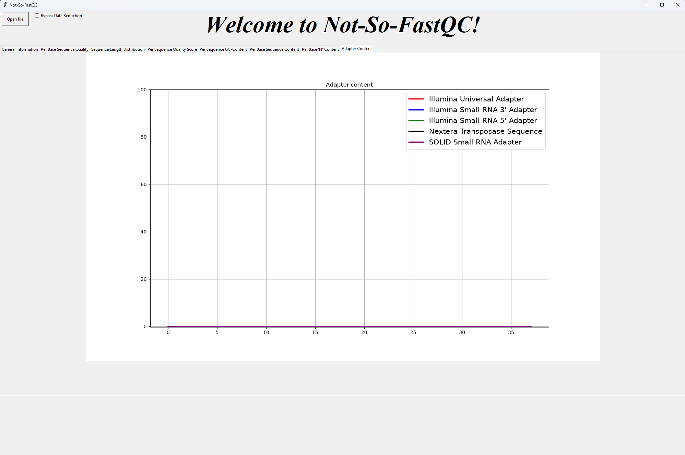

# **Not-So-FastQC**

*Disclaimer: Not-So-FastQC is an independent project and is not affiliated with, officially endorsed by, or maintained by the Babraham Institute.*

Old programming project from my bioinformatics bachelor education, and my first ever coding project. 

Not-So-FastQC is a high throughput sequence data quality control software inspired by the popular [FastQC](https://www.bioinformatics.babraham.ac.uk/projects/fastqc/) software. 

## Using the software:

Upon starting the [script](Not-So-FastQC.py), you will be met with a simple GUI window: 



Use the top left button to open a fastq file. By default, the software will sample the file in order to provide faster results. You can turn this off by checking the "bypass data reduction" checkbox. This will provide more accurate results, but will take a much longer time to compute.

Once a file is open, you will see basic statistics about the file, and tabs with the data plots:



The software will plot seven different descriptive plots:

### *Per Base Sequence Quality:* 
A BoxWhisker plot showing the reads quality ranges.



### *Sequence Length Distribution:* 
A histogram representing the length distribution across all reads in the FASTQ files.



### *Per Sequence Quality Score:*
A histogram representing the mean quality of the reads for each base position.



### *Per Sequence GC content:*
A histrogram representing the GC-content of the reads compared to a theoretical distribution.



### *Per Base Sequence Content:*
A line chart representing the proportion of the four DNA bases for each base position.



### *Adapter Content:*
A line chart representing the cumulative percentage of the proportion of the reads in which an
adapter sequence has been detected.




## Main Dependencies:

The software is fully written with Python, Main packages utilized include:

```
tkinker
Bio
matplotlib.pyplot
pandas
numpy
scipy.stats
matplotlib.backends.backend_tkagg

```
